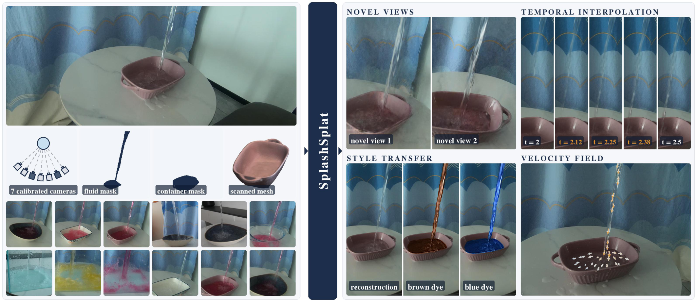

<div align="center">
  <h1>SplashSplat: Reconstructing Splashing Liquids from Real-World Multi-View Videos</h1>

  <strong>Peiyu Liu</strong><sup>1*</sup>&nbsp;&nbsp;&nbsp;&nbsp;
  <strong><a href="https://kristen-z.github.io/">Dingxi Zhang</a></strong><sup>2*</sup>&nbsp;&nbsp;&nbsp;&nbsp;
  <strong><a href="https://federicotombari.github.io/">Federico Tombari</a></strong><sup>3</sup>&nbsp;&nbsp;&nbsp;&nbsp;
  <strong><a href="https://people.inf.ethz.ch/marc.pollefeys/">Marc Pollefeys</a></strong><sup>2,4</sup>&nbsp;&nbsp;&nbsp;&nbsp;
  <strong><a href="https://scholar.google.com/citations?user=7D10QQkAAAAJ&hl=en">Christina Tsalicoglou</a></strong><sup>3</sup>&nbsp;&nbsp;&nbsp;&nbsp;
  <strong><a href="https://danini.github.io/">Daniel Barath</a></strong><sup>2,3</sup>

  <sup>1</sup> <em>EPFL</em>&nbsp;&nbsp;&nbsp;&nbsp;&nbsp;&nbsp;
  <sup>2</sup> <em>ETH Zurich</em>&nbsp;&nbsp;&nbsp;&nbsp;&nbsp;&nbsp;
  <sup>3</sup> <em>Google</em>&nbsp;&nbsp;&nbsp;&nbsp;&nbsp;&nbsp;
  <sup>4</sup> <em>Microsoft</em>

  <sup>*</sup> <em>Equal contribution</em>

  <a href="https://niko-creater.github.io/splashsplat-web/"></a>
  <a href="#"></a>
  <a href="https://drive.google.com/file/d/1fCnn-G1VN_iFrZdrx1MjwjD_7vaLqW8p/view?usp=sharing"></a>
</div>

<p align="center">
  
</p>

**SplashSplat** reconstructs **splashing liquids** from synchronized multi-view video.
Per-frame liquid SDFs fused from multi-view masks provide the geometry, level-set
transport between consecutive SDFs yields a coarse velocity field, and Lagrangian
carriers advected along this flow decode local Gaussians for differentiable
rendering. The same representation supports **novel-view synthesis**, **velocity
recovery**, **temporal interpolation** and **style transfer**.

This repository hosts the **SplashSplat benchmark**, the first synchronized
multi-view video dataset of splashing liquids. The reconstruction code will be
released here as well.

## Code

 **Coming soon** 

## Dataset

**Download:** [real_scene.zip (Google Drive)](https://drive.google.com/file/d/1fCnn-G1VN_iFrZdrx1MjwjD_7vaLqW8p/view?usp=sharing)

### Layout

```
data/
├── real_scene/                    # full-resolution captures
│   └── <scene>/                   # bowl_001 ... bowl_017, tank_001 ... tank_003 (20 scenes)
│       ├── ims/<cam>/<frame>.jpg  # RGB frames, cam 1-7, frame 000000-000049, 3840x2160
│       ├── seg/<cam>/<frame>.png  # liquid masks, single channel, 0 / 255
│       ├── container_mask/<cam>.png   # static container mask per camera, 3840x2160, 0 / 255
│       ├── train_meta.json        # cameras 1-5
│       ├── test_meta.json         # cameras 6-7
│       └── init_pt_cld.npz        # initial background point cloud
├── real_scene_crop/               # same 20 scenes cropped around the container (per-scene size,
│   └── <scene>/                   # e.g. 1280x1752); same layout and files as real_scene/,
│       ├── ims/<cam>/<frame>.jpg  # without container_mask/; intrinsics in *_meta.json are
│       ├── seg/<cam>/<frame>.png  # adjusted to the crop
│       ├── train_meta.json
│       ├── test_meta.json
│       └── init_pt_cld.npz
└── meshes/
    └── <scene>.glb                # scanned container meshes (bowl_001, bowl_002, bowl_003)
```

`train_meta.json` / `test_meta.json` follow the
[Dynamic 3D Gaussians](https://github.com/JonathonLuiten/Dynamic3DGaussians) format:

| key   | shape                       | meaning                              |
|-------|-----------------------------|--------------------------------------|
| `w`, `h` | scalar                   | image width / height                 |
| `k`   | `[n_frames][n_cams][3][3]`  | intrinsics                           |
| `w2c` | `[n_frames][n_cams][4][4]`  | world-to-camera extrinsics           |
| `fn`  | `[n_frames][n_cams]`        | image path relative to `ims/`        |

`init_pt_cld.npz` holds a single array `data` of shape `[N, 7]`:
`x, y, z, r, g, b, seg`, with colors in `[0, 1]`.

## Citation

```bibtex
@inproceedings{splashsplat,
  title     = {SplashSplat: Reconstructing Splashing Liquids from Real-World Multi-View Videos},
  author    = {Liu, Peiyu and Zhang, Dingxi and Tombari, Federico and Pollefeys, Marc and Tsalicoglou, Christina and Barath, Daniel},
  booktitle = {TODO},
  year      = {TODO}
}
```

## License

The SplashSplat dataset (frames, liquid masks, calibration and evaluation
splits) is released under the Creative Commons Attribution 4.0 International
([CC BY 4.0](LICENSE-DATA)) license. You are free to share and adapt the
material for any purpose, including commercially, as long as you give
appropriate credit, e.g. by citing the paper above.

The code is released under the [MIT License](LICENSE).
